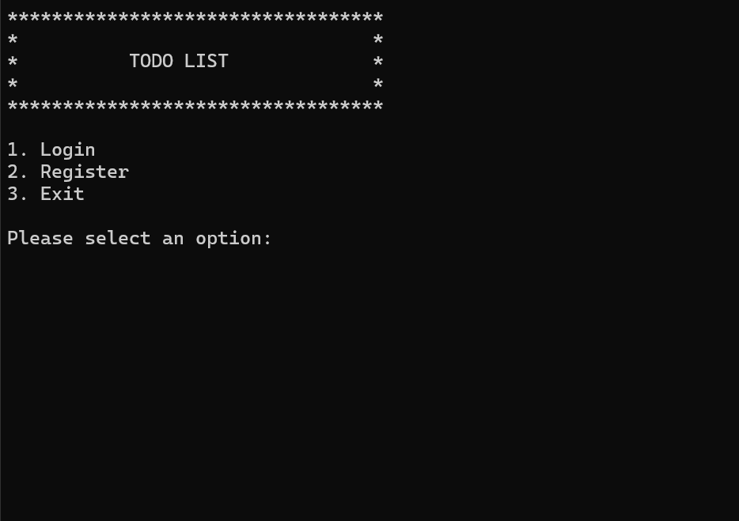

# ✅ C++ Console TODO List Application

## 📸 Screenshot


## 📌 Overview
This is a simple **console-based Task Management (TODO List) application** written in **C++**.  
It allows users to **register, login, manage their tasks**, and provides **Admin users** with the ability to manage other users.  

The project demonstrates the use of:
- User authentication (login & register)
- Role-based access (Admin/User)
- Task management (CRUD operations)
- Console-based menus and navigation

---

## 🎯 Features

### 👤 User Features
- Register and login with email & password
- View **only your own tasks**
- Add new tasks
- Update your existing tasks
- Delete tasks
- View personal profile (ID, Name, Email, Role)

### 🛠️ Admin Features
- All user features (own tasks)
- View all registered users
- Add new users
- Update existing users
- Delete users

---

## 🚀 How to Run
1. Clone or download this repository.
2. Open the project in a C++ IDE (e.g., **Dev C++**, **Code::Blocks**, **Visual Studio**) or compile using g++:

```bash
g++ main.cpp -o todo
./todo
```

---

## 🧑‍💻 Usage

### 🔑 Login/Register
- Default admin user is created automatically:  
  - **Email:** `admin@gmail.com`  
  - **Password:** `admin`  

---

### 👤 User Menu
- **View Tasks** → Displays only tasks created by you  
- **Add Task** → Add a new task for yourself  
- **Update Task** → Modify your task details  
- **Delete Task** → Remove a task you created  
- **Profile** → View your profile  
- **Logout** → Exit back to main menu  

---

### 🛠️ Admin Menu (extra options)
- **View Users** → List of all users  
- **Add User** → Create new user (Admin or normal)  
- **Update User** → Edit user details  
- **Delete User** → Remove a user  

---

## 🔮 Future Enhancements
- **Assign tasks to other users** (currently tasks are self-assigned)  
- **Save/load users and tasks from a file** (persistent storage)  
- **Add due dates & priorities to tasks**  
- **Improve UI formatting**
- Integrate with MySQL DB and also storage in File System
